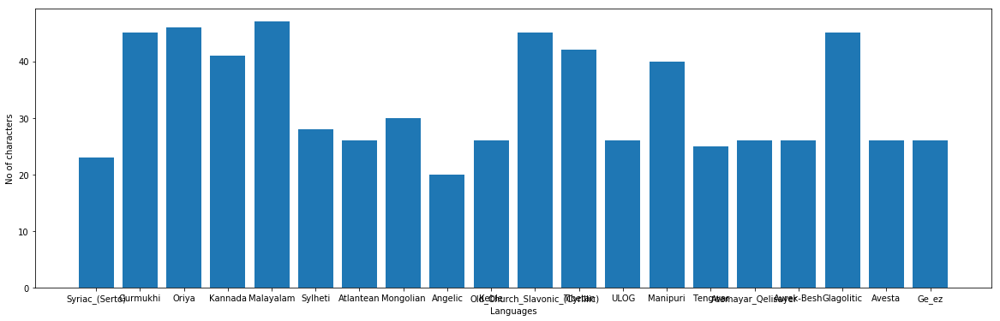
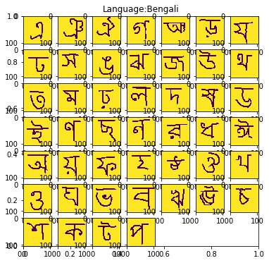
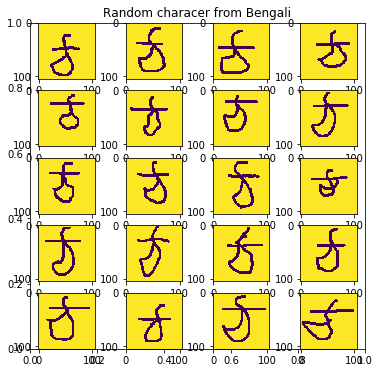
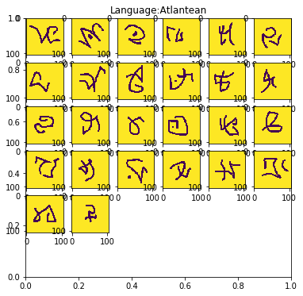
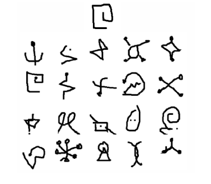
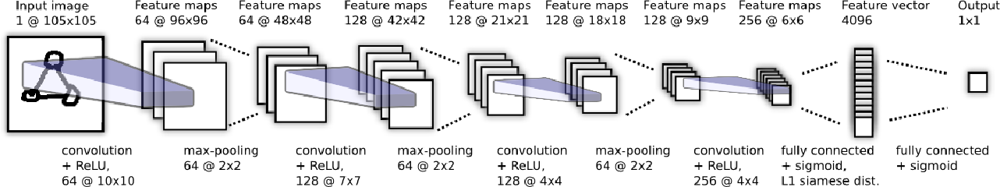
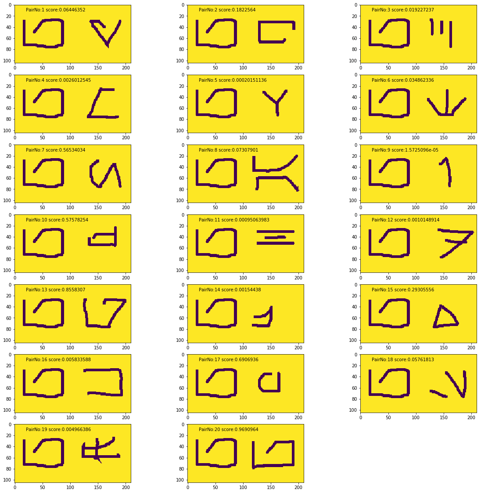
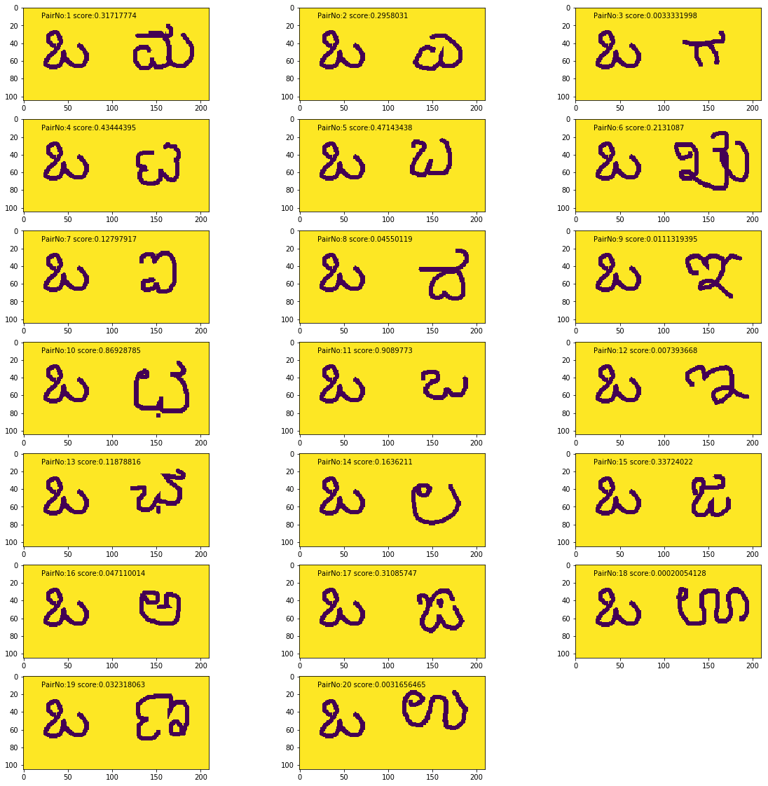

# One-Shot Learning
Welcome to the Challenge Problem presented by [Fellowship.ai](https://fellowship.ai/challenge/)

Here we will analyse, explore and solve the One-Shot Learning for omniglot Dataset.

In this notebook, we would go through:
* **Exploratory Data Analysis** 
* **Problem Definition** 
* **Approches** 
* **Result Analysis**

### Exploratory Data Analysis
Lets load the required packages


```python
# Load Library
import os
import numpy as np
import matplotlib.pyplot as plt
import utils

# Load background and evaluation Dataset
train_dir = "/aitoe/QuickDraw/Ronak/omniglot/images_background/"
eval_dir = "/aitoe/QuickDraw/Ronak/omniglot/images_evaluation/"
```

    Using TensorFlow backend.


- The Omniglot dataset is a collection of 1623 hand drawn characters from total 50 alphabet.
- For every character there are just 20 examples, each drawn by a different person at resolution 105x105. Omniglot is sometimes referred to as the transpose of mnist, since it has 1623 types of character with only 20 examples each, in contrast to MNIST having thousands of examples for only 10 digits.
- Lets understand these omniglot Dataset


```python
utils.show_distributions(eval_dir)
```





- The Dataset is divided into background set and evaluation set.
- There are 30 types of alphabets in background set like Koren, Latin, Gujarati, Hebrew, Sanskrit etc. Each alphabet has as minimum as 14 to max as 55 letters. Each letter has 20 samples drawn by 20 different people. 
- There are another 20 alphabet in evalaution set like Kannada, Malayalam, Avesta etc. Each alphabet has as minimum as 20 to as maximum as 47 letters. Each character has 20 samples drawn by 20 different people.
- As in above bar chart, there are around 40 letters for kannada and around 20 for Angelic
- All those different letters from different alphabets make for lots of possible one-shot tasks, so it’s a really good benchmark for one-shot learning algorithms.
- Let us visualise few of these alphabets


```python
alphabet = utils.show_all_characters(train_dir)
```





**These are all letters from alphabet Bengali and below plot shows 20 samples of one of its letters drawn by 20 different people**


```python
utils.show_all_samples(train_dir,alphabet)
```





**Below we see all letters from Atlantean of evaluation set and corresponding all the 20 samples of one of its letters**


```python
alphabet = utils.show_all_characters(eval_dir)
utils.show_all_samples(eval_dir,alphabet)
```





*We can play around with the above functions, It randomly chooses the alphabet and corresponding letter. It is worth looking at the variation among letters and its corresponding samples*

### Problem Definition

**Task:**  To measure 20-way one-shot classification performance on evaluation set by learning hyperparameters and feature mappings from background set. <br>

The lone test image is shown above the grid of 20 images representing the possible unseen classes that we can choose for the test image.  These 20 images are our only known examples of each of those classes.
<br>
All the letters in above image belong to one of the alphabet from evaluation set.The performance would be calculate on how better the test image is able to match with its original class. We would discuss the performance evaluation in more detail ahead.
 
**Challenges:** Challenge is to learn good features from background set where little data is available and then make correct predictions, given only a single example of each new class. The real question is 
<font color=blue>*"What types of representations can be learned from just one or a few examples,
and how can these representations support such flexible generalizations?"*</font>


### Approach

- One of the way to learn better representation which generalizes well is siamese neural network. 
- [This](https://www.cs.cmu.edu/~rsalakhu/papers/oneshot1.pdf) paper explore a method for learning siamese neural networks which employ a unique structure to naturally rank similarity between inputs
- Once the network has been tuned, It can then capitalize on powerful discriminative features to generalize the predictive power of the network not just to new data, but to entirely new classes from unknown distributions. 
- The goal is to learn image representations via a supervised metric-based approach with siamese neural networks, then reuse that network’s features for one-shot learning without any retraining.
- This paper uses 40 background alphabets and 10 evaluation alphabets
- The authors use 20-way one-shot task for evaluating the performance in the evaluation set. For each alphabet it is performed 40 different one-shot tasks, completing a total of 400 tasks for the 10 evaluation alphabets.
- Let's dive into the methodology proposed by Koch_et al._ to solve this one-shot task problem.


### Methodology
- Siamese nets are two twin networks that accept distinct inputs but are joined in by a energy function that calculates a distance metric between the outputs of the two nets. The weights of both networks are tied, allowing them to compute the same function. 
- Also, the network is symmetric, so that whenever we present two distinct images to the twin networks, the top conjoining layer will compute the same metric as if we were to we present the same two images but to the opposite twins.
- In LeCun et al., the authors used a contrastive energy function which contained dual terms to decrease the energy of like pairs and increase the energy of unlike pairs. However,In this paper the weighed L1 distance between twin feature vectors is used as energy function, combined with a sigmoid activations. 
- Below image depicts the best convolutional architecture considered for verification task
<br>

<br>
- These neural net consist of 3 blocks of Cov-RELU-Pooling followed by Cov-ReLU connected to a fully connected layer with a sigmoid functions.This layer produces the feature vectors that will be fused by the L1 weighed distance layer. The output is fed to a final layer that outputs a value between 1 and 0 (same class or different class). To assess the best architecture, Bayesian hyper-parameter tuning was performed

**Below code reference is taken from this [repo](https://github.com/Goldesel23/Siamese-Networks-for-One-Shot-Learning)**<br>
Lets construct a siamese network


```python
import os

import keras.backend as K
from keras.models import Model, Sequential
from keras.layers import Conv2D, MaxPool2D, Flatten, Dense, Input, Subtract, Lambda
from keras.optimizers import Adam, SGD
from keras.regularizers import l2
import keras.backend as K

import tensorflow as tf

import matplotlib.pyplot as plt
import matplotlib.gridspec as gridspec
import numpy as np

def SiameseModel(self, learning_rate_multipliers,
                                     l2_regularization_penalization):
    # Let's define the cnn architecture
    convolutional_net = Sequential()
    convolutional_net.add(Conv2D(filters=64, kernel_size=(10, 10),
                                 activation='relu',
                                 input_shape=self.input_shape,
                                 kernel_regularizer=l2(
                                     l2_regularization_penalization['Conv1']),
                                 name='Conv1'))
    convolutional_net.add(MaxPool2D())

    convolutional_net.add(Conv2D(filters=128, kernel_size=(7, 7),
                                 activation='relu',
                                 kernel_regularizer=l2(
                                     l2_regularization_penalization['Conv2']),
                                 name='Conv2'))
    convolutional_net.add(MaxPool2D())

    convolutional_net.add(Conv2D(filters=128, kernel_size=(4, 4),
                                 activation='relu',
                                 kernel_regularizer=l2(
                                     l2_regularization_penalization['Conv3']),
                                 name='Conv3'))
    convolutional_net.add(MaxPool2D())

    convolutional_net.add(Conv2D(filters=256, kernel_size=(4, 4),
                                 activation='relu',
                                 kernel_regularizer=l2(
                                     l2_regularization_penalization['Conv4']),
                                 name='Conv4'))
    convolutional_net.add(MaxPool2D())

    convolutional_net.add(Flatten())
    convolutional_net.add(
        Dense(units=4096, activation='sigmoid',
              kernel_regularizer=l2(
                  l2_regularization_penalization['Dense1']),
              name='Dense1'))

    # Now the pairs of images
    input_image_1 = Input(self.input_shape)
    input_image_2 = Input(self.input_shape)

    encoded_image_1 = convolutional_net(input_image_1)
    encoded_image_2 = convolutional_net(input_image_2)

    # L1 distance layer between the two encoded outputs
    # One could use Subtract from Keras, but we want the absolute value
    l1_distance_layer = Lambda(
        lambda tensors: K.abs(tensors[0] - tensors[1]))
    l1_distance = l1_distance_layer([encoded_image_1, encoded_image_2])

    # Same class or not prediction
    prediction = Dense(units=1, activation='sigmoid')(l1_distance)
    self.model = Model(
        inputs=[input_image_1, input_image_2], outputs=prediction)
    
    # Define the optimizer and compile the model
    optimizer = SGD(lr=0.01, decay=1e-6, momentum=0.9, nesterov=True)

    self.model.compile(loss='binary_crossentropy', metrics=['binary_accuracy'],
                       optimizer=optimizer)
```

Lets load the data and do data augmentation
- 80% of background set is used for training and remaining 20% for validation
- Perform affine distortions to augment the dataset which includes rotation,shear,zoom and shift
- For every training batch, uniformaly a alphabet is selected. For batch of n, n/2 pairs of different classes and n/2 pairs of the same class are created. Each batch will only contains samples from one single alphabet.
- To start the training run train_siamese_network.py

#### Evaluation
To empirically evaluate one-shot learning performance, Lake developed a 20-way within-alphabet classification task in which an alphabet is first chosen from among those reserved for the evaluation set, along with twenty characters taken uniformly at random. Two of the twenty drawers are also selected from among the pool of evaluation drawers. These two drawers then produce a sample of the twenty characters. Each one of the characters produced by the first
drawer are denoted as test images and individually compared against all twenty characters from the second drawer, with the goal of predicting the class corresponding to the test image from among all of the second drawer’s charac-
ters.This process is repeated twice for all alphabets, so that there are 40 one-shot learning trials for each of the ten evaluation alphabets.This constitutes a total of 400 one-shot learning trials, from which the classification accuracy is calculated.
<br>
<br>
I trained omniglot dataset by using these [implementation](https://github.com/Goldesel23/Siamese-Networks-for-One-Shot-Learning) for only 30000 iterations. <br>
Let us evaluate its performance. 


```python
utils.show_evaluation_result()
```

    Trained Ended!
    
    Making One Shot Task on evaluation alphabets:
    Sylheti alphabet, accuracy: 0.625
    Oriya alphabet, accuracy: 0.45
    Syriac_(Serto) alphabet, accuracy: 0.425
    Atlantean alphabet, accuracy: 0.675
    Avesta alphabet, accuracy: 0.825
    Malayalam alphabet, accuracy: 0.725
    Keble alphabet, accuracy: 0.75
    Old_Church_Slavonic_(Cyrillic) alphabet, accuracy: 0.7
    Atemayar_Qelisayer alphabet, accuracy: 0.575
    Gurmukhi alphabet, accuracy: 0.65
    Tibetan alphabet, accuracy: 0.725
    Aurek-Besh alphabet, accuracy: 0.85
    Glagolitic alphabet, accuracy: 0.55
    Angelic alphabet, accuracy: 0.7
    Ge_ez alphabet, accuracy: 0.75
    ULOG alphabet, accuracy: 0.725
    Tengwar alphabet, accuracy: 0.6
    Kannada alphabet, accuracy: 0.45
    Manipuri alphabet, accuracy: 0.675
    Mongolian alphabet, accuracy: 0.575
    
    Mean global accuracy: 0.65
    Final Evaluation Accuracy = 0.65


### Result Analysis
- The results are pretty impressive. with just 2 hours of training, we are able to get 65% mean global accuracy. This results is a proof that transfer learning does work and siamese network learns a very good feature representation which generalizes soo well in evaluation set.We are able to get 85% accuracy for Aurek-Besh alphabet which is quite impressive.
- Author of paper have reported mean global accuracy around 90%. To achieve the similar results,we can
    - Train longer
    - Evalaute accuracy on 10 test alphabet while we have used whole evaluation set of 20 alpabet for evalution
    - Our train-valid-test split are different than discussed in paper,, we can make it similar and check the accuracy
    - In the paper the learning rate decays 1% each epoch, while in this implementation it decays 1% each 500 iterations.
    - Author used bayesian hyperparameter optimization or architecture design. We used the one of the best network suggested in paper. Further refinement in architecture design could be done with the help of bayesian optimization techniques
    - While training, model tend to overfit. We can try to use larger values of regularizer for subsequent layers in current architecture and can as well use dropout to prevent overfitting
- Lets visualize some of our result


```python
def visualise(data_dir,language):
    index = 0
    fig=plt.figure(figsize=(20, 20))
    siamese_network = utils.load_siamese_model()
    lang_path = os.path.join(data_dir,language)
    character_list = os.listdir(lang_path)
    selected_20_character = np.random.choice(character_list,20, replace=False)
    selected_character = np.random.choice(selected_20_character)
    selected_character_path = os.path.join(lang_path,selected_character)
    drawers = np.random.choice(os.listdir(selected_character_path))
    image1 = plt.imread(os.path.join(selected_character_path,drawers))
    for character in selected_20_character:
        index = index + 1
        character_path = os.path.join(lang_path,character)
        drawers = np.random.choice(os.listdir(character_path))
        image2 = plt.imread(os.path.join(character_path,drawers))
        number_of_pairs = 1
        pairs_of_images = [np.zeros((number_of_pairs, 105, 105, 1)) for i in range(2)]
        for pair in range(number_of_pairs):
            image = image1
            image = np.asarray(image).astype(np.float64)
            image = image / image.std() - image.mean()

            pairs_of_images[0][pair, :, :, 0] = image
            image = image2
            image = np.asarray(image).astype(np.float64)
            image = image / image.std() - image.mean()
            pairs_of_images[1][pair, :, :, 0] = image
        probabilities = siamese_network.model.predict_on_batch(pairs_of_images)

        combined_image = np.concatenate((image1,image2),axis=1)
        fig.add_subplot(7,3,index)
        plt.imshow(combined_image)
        plt.text(20,12,"PairNo:"+ str(index) + " score:" + str(probabilities[0][0]))
    plt.show()
```

### Visual Analysis
- We got 85% accuracy on Aurek-Besh alphabet.
- We perform 20-way one-shot test and as we can see pair 20 get the highest score and it is the right match.
- We can see its performance when paired with other letters. It gives relatively high score for pair No 10,13,17.
- It look quite convincing the reason for these high score with these pairs since they look quite similar to the test letter.
- It gives the minimum score for pair no 9 which is just straight line. Hence we can conclude here that siamese neural network is able to understand the shapes.


```python
visualise(eval_dir,"Aurek-Besh")
```

    Trained Ended!





- We got 42.5% accuracy on Kannada alphabet.
- We can see it gives relatively higher score for pair No 1,2,4,5,10,11.
- These letters are visually quite similar.


```python
visualise(eval_dir,"Kannada")
```

    Trained Ended!





### Conclusion:
- Since network get confused for similar letters, It is worth looking at using stroke level information.
- Time based stroke information is a additional information which could help to distinguish among similar characters.
- Another approach like [Memory Matching Networks for One-Shot Image Recognition](https://arxiv.org/pdf/1804.08281v1.pdf) claims to get around 99.28% accuracy. 
- Siamese network have shown good results with triplet loss as energy functions. We can perform a comparitive study about representative feature learnt from these training.
- We must perform deconvolution and visualize filters to understand what current siamese network has learnt and how it is able to generalize among different alphabet and improvise siamese network by taking inference from it.


